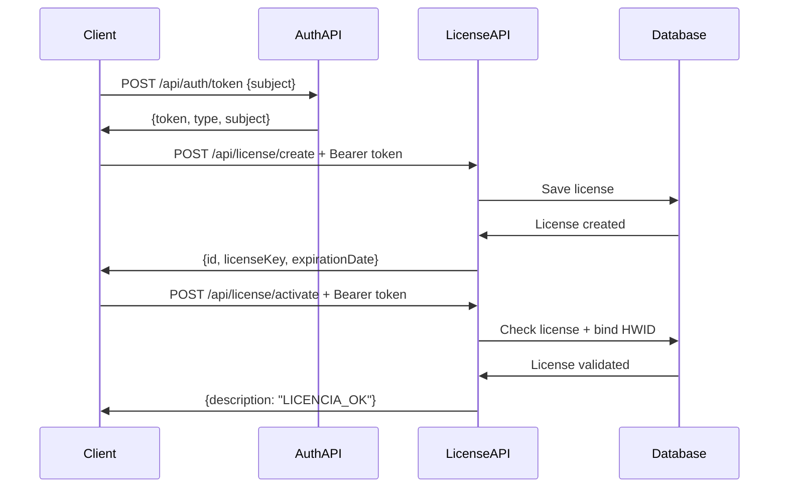

# License Validation Service

[](https://www.oracle.com/java/)
[](https://spring.io/projects/spring-boot)
[](target/site/jacoco/index.html)
[](LICENSE)

REST API service for managing and validating software licenses with hardware-based binding and JWT encryption (JWE) security.

> **🚀 New to this project?** Check out the [Quick Start Guide](QUICKSTART.md) to get running in 2 minutes!

## Features

- 🔐 **JWE Authentication**: Secure token-based authentication using JSON Web Encryption
- 🖥️ **Hardware Binding**: License tied to specific machine hardware IDs (HWID)
- ⏰ **Expiration Management**: Configurable license validity periods
- 🔒 **First-Use Activation**: License binds to hardware on first activation
- ✅ **Validation**: Comprehensive license validation (existence, expiration, HWID match)
- 📧 **Email Notifications**: Automatic email notifications via MailerSend REST API when licenses are created
- ⏰ **Expiration Warnings**: Scheduled task sends email alerts 1 day before license expiration
- 💾 **Automatic Backups**: Scheduled H2 database backups uploaded to Cloudflare R2
- 🧪 **Well Tested**: 90% code coverage with 47 unit and integration tests

## Quick Start

### Prerequisites

- Java 25 or higher
- Maven 3.6+
- Database (H2 for development, configurable for production)

### Installation

```bash
# Clone the repository
git clone <repository-url>
cd lib-validate-license

# Build the project
mvn clean install

# Run the application
mvn spring-boot:run
```

The server will start on `http://localhost:8199` (configurable via `SERVER_PORT` environment variable).

### Database

The application uses **H2 embedded database** by default:
- Database file: `./data/licenses.db` (created automatically)
- H2 Console: http://localhost:8199/h2-console
  - JDBC URL: `jdbc:h2:file:./data/licenses`
  - Username: `sa`
  - Password: (empty)

**📖 See [DATABASE.md](DATABASE.md) for detailed database configuration, migration guides, and production setup.**

### Configuration

The application is configured via environment variables. Copy `.env.example` to `.env` and fill in your values:

```bash
cp .env.example .env
```

**⚠️ Important**:
- Set `JWE_SECRET_KEY` with a minimum 32-character secret key for production
- Set `MAILERSEND_API_TOKEN` with a valid MailerSend API token to enable email notifications
- Set Cloudflare R2 credentials (`R2_ACCOUNT_ID`, `R2_ACCESS_KEY_ID`, `R2_SECRET_ACCESS_KEY`) to enable backups
- Disable H2 console in production: `H2_CONSOLE_ENABLED=false`

## API Usage

### 1. Generate Authentication Token

```bash
curl -X POST http://localhost:8199/api/auth/token \
  -H "Content-Type: application/json" \
  -d '{"subject": "client-app-001"}'
```

Response:
```json
{
  "token": "eyJhbGciOiJkaXIiLCJlbmMiOiJBMjU2R0NNIn0...",
  "type": "Bearer",
  "subject": "client-app-001"
}
```

### 2. Create a License

```bash
curl -X POST http://localhost:8199/api/license/create \
  -H "Authorization: Bearer <token>" \
  -H "Content-Type: application/json" \
  -d '{
    "licenseKey": "ABC-123-XYZ",
    "email": "user@example.com",
    "validDays": 365
  }'
```

Response:
```json
{
  "id": 1,
  "licenseKey": "ABC-123-XYZ",
  "email": "user@example.com",
  "expirationDate": "2027-01-23",
  "active": false
}
```

**Note**: An email will be automatically sent to the provided address with license details.

### 3. Activate a License

```bash
curl -X POST http://localhost:8199/api/license/activate \
  -H "Authorization: Bearer <token>" \
  -H "Content-Type: application/json" \
  -d '{
    "licenseKey": "ABC-123-XYZ",
    "hwid": "HARDWARE-ID-12345"
  }'
```

Response:
```json
{
  "description": "LICENCIA_OK",
  "expirationDate": "2027-01-23"
}
```

## API Endpoints

| Endpoint | Method | Auth Required | Description |
|----------|--------|---------------|-------------|
| `/api/auth/token` | POST | No | Generate JWE authentication token |
| `/api/license/create` | POST | Yes | Create a new license |
| `/api/license/activate` | POST | Yes | Activate/validate a license |

## Security

### JWE Token Authentication

All license endpoints require a valid JWE token in the `Authorization` header:

```
Authorization: Bearer <jwe-token>
```

**Token Configuration**:
- **Algorithm**: Direct Encryption (DIR)
- **Encryption**: AES-256-GCM
- **Expiration**: Configurable (default: 1 hour)
- **Secret Key**: Must be exactly 32 characters for AES-256

### License Validation Rules

1. **Unique License Keys**: No duplicate license keys allowed
2. **First Activation**: License binds to hardware ID (HWID) on first use
3. **HWID Lock**: Subsequent activations must use the same HWID
4. **Expiration**: License expires after configured validity period
5. **Token Required**: All operations require valid JWE token

## Email Configuration

The service sends automatic HTML email notifications via the **MailerSend REST API** (no SMTP).

### MailerSend Setup

1. Create an account at [mailersend.com](https://www.mailersend.com)
2. Verify your sending domain
3. Generate an API token in **Email → API Tokens**
4. Set the environment variables:

```bash
MAILERSEND_API_TOKEN=mlsn.your-token-here
MAILERSEND_API_URL=https://api.mailersend.com/v1/email   # default, can be omitted
EMAIL_FROM=noreply@yourdomain.com   # must be a verified domain in MailerSend
EMAIL_ENABLED=true
```

### Disable Email Notifications

```bash
EMAIL_ENABLED=false
```

### Email Templates

HTML templates located in `src/main/resources/templates/`:
- `LicenseCreate.html` — sent on license creation
- `LicenseExpiration.html` — sent as expiration warning

Email failures are non-blocking: errors are logged but do not interrupt license operations or backup execution.

## Backup Configuration

The service automatically backs up the H2 database to **Cloudflare R2** on a configurable schedule.

### Cloudflare R2 Setup

1. Create a bucket in your Cloudflare R2 dashboard
2. Generate an API token in **R2 → Manage R2 API Tokens**
3. Set the environment variables:

```bash
BACKUP_ENABLED=true
BACKUP_RUN_ON_STARTUP=true        # run a backup immediately on startup
BACKUP_CRON=0 0 1 * * ?           # daily at 1:00 AM (Spring cron format)
BACKUP_LOCAL_DIR=/app/data/backups
BACKUP_MAX_FILES=7                # number of backups to retain in R2

# Cloudflare R2 Credentials
R2_ACCOUNT_ID=your-cloudflare-account-id
R2_ACCESS_KEY_ID=your-r2-access-key-id
R2_SECRET_ACCESS_KEY=your-r2-secret-access-key
R2_BUCKET_NAME=licenses-backup
```

The R2 endpoint is built automatically: `https://<R2_ACCOUNT_ID>.r2.cloudflarestorage.com`

### Backup Behavior

- Backup file name: `licenses-yyyyMMdd-HHmmss.zip` (compressed H2 snapshot)
- Only the `BACKUP_MAX_FILES` most recent backups are kept in R2; older ones are deleted automatically
- Backup failures (R2 upload/cleanup) are non-blocking: errors are logged but do not stop the application
- H2 snapshot is always attempted first before uploading to R2

### Disable Backups

```bash
BACKUP_ENABLED=false
```

## Scheduled Tasks

The service includes an automated task that monitors license expirations and sends warning emails.

### License Expiration Warnings

**Functionality**:
- Runs daily at 9:00 AM (configurable)
- Finds all active licenses expiring the next day
- Sends warning email to each license owner
- Logs all actions for monitoring

**Configuration**:

```bash
# Enable/disable the scheduler
SCHEDULER_ENABLED=true

# Customize execution time (cron format)
SCHEDULER_CRON=0 0 9 * * ?  # Daily at 9:00 AM
```

**Cron Expression Examples**:

```bash
# Every day at 9:00 AM
0 0 9 * * ?

# Every day at 6:00 PM
0 0 18 * * ?

# Every Monday at 8:00 AM
0 0 8 * * MON

# Every hour at minute 0
0 0 * * * ?

# Every 30 minutes
0 */30 * * * ?
```

**Cron Format**: `second minute hour day month dayOfWeek`

### Email Warning Content

The expiration warning email includes:
- License key
- Expiration date
- Action required notice
- Consequences of expiration
- Support contact information

### Disable Scheduler

To disable the scheduled task (e.g., in development):

```bash
SCHEDULER_ENABLED=false
```

Or in `application.yml`:

```yaml
scheduler:
  expiration-warning:
    enabled: false
```

### Monitoring

The scheduler logs:
- ✅ Task execution start/completion
- 📊 Number of licenses found expiring
- ✉️ Email sending success/failure for each license
- ❌ Any errors encountered

Check logs for entries like:
```
INFO  - Starting scheduled task: checking licenses expiring tomorrow
INFO  - Found 3 license(s) expiring tomorrow (2026-01-27)
INFO  - Sending expiration warning for license: ABC-123 to email: user@example.com
INFO  - Scheduled task completed. Success: 3, Failures: 0
```

## Development

### Running Tests

```bash
# Run all tests
mvn test

# Run with coverage report
mvn clean test jacoco:report

# Run specific test
mvn test -Dtest=JweServiceTest

# Run integration tests only
mvn test -Dtest=*IntegrationTest
```

Coverage report available at: `target/site/jacoco/index.html`

### Test Coverage

- **Overall**: 90%
- **Controllers**: 100%
- **Security Layer**: 97%
- **Services**: 100%
- **Models**: 94%
- **Total Tests**: 47 (unit + integration)

### Project Structure

```
src/
├── main/
│   ├── java/co/com/validate/license/
│   │   ├── controller/          # REST controllers
│   │   │   ├── AuthController.java
│   │   │   └── LicenseRestController.java
│   │   ├── security/            # JWE security components
│   │   │   ├── JweService.java
│   │   │   ├── JweProperties.java
│   │   │   ├── JweAuthenticationFilter.java
│   │   │   ├── JweAuthenticationEntryPoint.java
│   │   │   └── SecurityConfig.java
│   │   ├── config/              # Infrastructure configuration
│   │   │   ├── MailerSendConfig.java
│   │   │   ├── R2Config.java
│   │   │   └── BackupProperties.java
│   │   ├── service/             # Business services
│   │   │   ├── EmailService.java
│   │   │   ├── BackupService.java
│   │   │   ├── BackupStartupRunner.java
│   │   │   └── LicenseExpirationScheduler.java
│   │   ├── model/               # Data models
│   │   │   ├── License.java
│   │   │   ├── CreateLicenseRequest.java
│   │   │   ├── LicenseRequest.java
│   │   │   └── LicenseResponse.java
│   │   ├── repository/          # Data access
│   │   │   └── LicenseRepository.java
│   │   ├── exception/           # Exception handling
│   │   │   ├── ResponseExceptionHandler.java
│   │   │   └── ZMessManager.java
│   │   └── RunServer.java       # Application entry point
│   └── resources/
│       ├── application.yml      # Application configuration
│       └── log4j2.xml          # Logging configuration
└── test/
    ├── java/co/com/validate/license/
    │   ├── controller/          # Controller tests
    │   ├── security/            # Security tests
    │   └── integration/         # Integration tests
    └── resources/
        └── application-test.yml # Test configuration
```

## Technology Stack

- **Java**: 25 (LTS)
- **Spring Boot**: 3.4.4
- **Spring Security**: 6.4.x — JWE-based authentication
- **Spring Data JPA**: Database access
- **MailerSend REST API**: HTML email notifications (via `RestClient`)
- **AWS SDK v2 S3**: 2.26.26 — Cloudflare R2 backup integration
- **Nimbus JOSE+JWT**: 9.48 (JWE encryption)
- **Lombok**: 1.18.42 — Boilerplate reduction
- **Log4j2**: Logging
- **JaCoCo**: 0.8.14 — Code coverage
- **JUnit 5**: Testing framework
- **H2 Database**: Embedded file-based database (in-memory for tests)
- **Maven**: Build tool

## Error Handling

The API returns consistent error responses:

### 400 Bad Request
- Invalid request body
- Duplicate license key
- Validation errors

### 401 Unauthorized
- Missing or invalid JWE token
- Expired token

### 403 Forbidden
- License not found
- License expired
- HWID mismatch (license used on different PC)

### 500 Internal Server Error
- Server-side errors
- Token generation failures

## Building for Production

```bash
# Build JAR
mvn clean package

# Run JAR
java -jar target/lib-validate-license-0.0.1-SNAPSHOT.jar \
  -DJWE_SECRET_KEY=your-32-character-secret-key \
  -DSERVER_PORT=8199
```

### Production Checklist

- [ ] Set secure `JWE_SECRET_KEY` (minimum 32 characters for AES-256-GCM)
- [ ] Configure production database (PostgreSQL/MySQL recommended)
- [ ] **Disable H2 console** (`H2_CONSOLE_ENABLED=false`)
- [ ] **Configure MailerSend** (`MAILERSEND_API_TOKEN`, `EMAIL_FROM` with verified domain)
- [ ] Test email delivery in production environment
- [ ] **Configure Cloudflare R2 backup** (`R2_ACCOUNT_ID`, `R2_ACCESS_KEY_ID`, `R2_SECRET_ACCESS_KEY`, `R2_BUCKET_NAME`)
- [ ] Verify backup execution on startup (`BACKUP_RUN_ON_STARTUP=true`)
- [ ] Set appropriate backup schedule (`BACKUP_CRON`) and retention (`BACKUP_MAX_FILES`)
- [ ] **Configure scheduler** (set appropriate cron expression for timezone)
- [ ] Verify scheduled task execution in production
- [ ] Use `--spring.profiles.active=prod` profile
- [ ] Set DDL mode to `validate` (no auto schema changes)
- [ ] Restrict CORS origins in `SecurityConfig`
- [ ] Configure proper logging levels
- [ ] Set up monitoring and health checks
- [ ] Review and adjust token expiration time (`JWE_EXPIRATION_SECONDS`)
- [ ] Secure `/api/auth/token` endpoint (if needed)

## License Workflow



## Contributing

1. Fork the repository
2. Create a feature branch (`git checkout -b feature/amazing-feature`)
3. Commit your changes (`git commit -m 'Add amazing feature'`)
4. Push to the branch (`git push origin feature/amazing-feature`)
5. Open a Pull Request

### Code Style

- Follow Java naming conventions
- Use Lombok annotations to reduce boilerplate
- Write unit tests for new features (maintain 90% coverage)
- Document public APIs with JavaDoc

## Troubleshooting

### Common Issues

**Q: Getting "KeyLengthException: The Content Encryption Key length must be 32 bytes"**
A: Ensure your `JWE_SECRET_KEY` is exactly 32 characters long.

**Q: Tests failing with database errors**
A: Check that H2 dependency is present in test scope and `application-test.yml` is configured correctly.

**Q: "Unauthorized" errors on all requests**
A: Verify you're including the `Authorization: Bearer <token>` header with a valid token.

**Q: "Licencia usada en otro PC" error**
A: The license is already bound to a different hardware ID. Each license can only be used on one machine.

## Support

For issues, questions, or contributions, please open an issue in the repository.

## Acknowledgments

- Built with [Spring Boot](https://spring.io/projects/spring-boot)
- Secured with [Nimbus JOSE+JWT](https://connect2id.com/products/nimbus-jose-jwt)
- Testing with [JUnit 5](https://junit.org/junit5/)

---

**Made with ☕ and Spring Boot**
